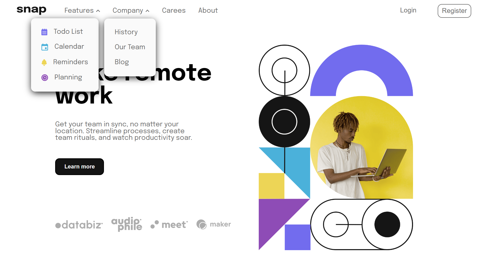
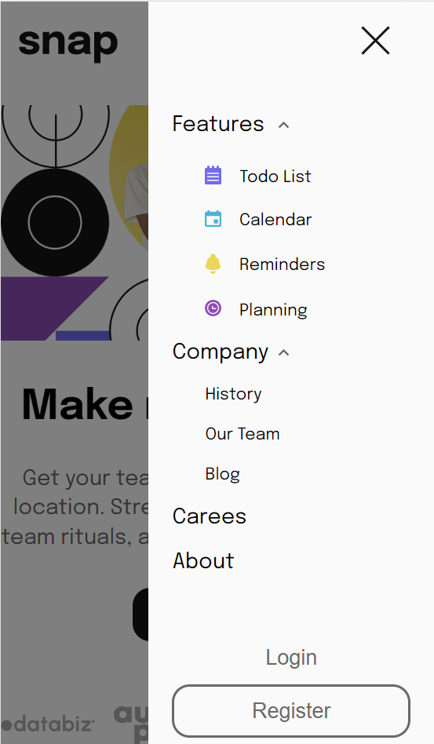

# Frontend Mentor - Intro section with dropdown navigation solution

Esta é uma solução para a [Intro section with dropdown navigation challenge on Frontend Mentor](https://www.frontendmentor.io/challenges/intro-section-with-dropdown-navigation-ryaPetHE5). Os desafios do Frontend Mentor ajudam você a melhorar suas habilidades de codificação criando projetos realistas.

### The challenge

Os usuários devem ser capazes de:

- Visualizar os menus suspensos relevantes no desktop e no celular ao interagir com os links de navegação
- Visualizar o layout ideal para o conteúdo, dependendo do tamanho da tela do dispositivo
- Ver os estados de foco para todos os elementos interativos na página

### Screenshot

### Built with

- HTML5
- CSS3
- Mobile-first workflow
- JavaScript

### What I learned

Neste projeto eu pude colocar em prática os conceitos de Mobile First pois ao desenvolvê-lo, o fiz responsivo para celular (375px). Além de ter sido um projeto simples, foi divertido e aprendi alguns conceitos de posicionamento de elementos na tela.``

### Continued development

Use this section to outline areas that you want to continue focusing on in future projects. These could be concepts you're still not completely comfortable with or techniques you found useful that you want to refine and perfect.

## Author

- Website - [Rodrigo Souza](https://rodrigobsouza.github.io/eu-rodrigo/)
- Frontend Mentor - [@RodrigoBSouza](https://www.frontendmentor.io/profile/RodrigoBSouza)
- LinkedIn - [@rodrigo-b-souza](https://www.linkedin.com/in/rodrigo-b-souza/)

